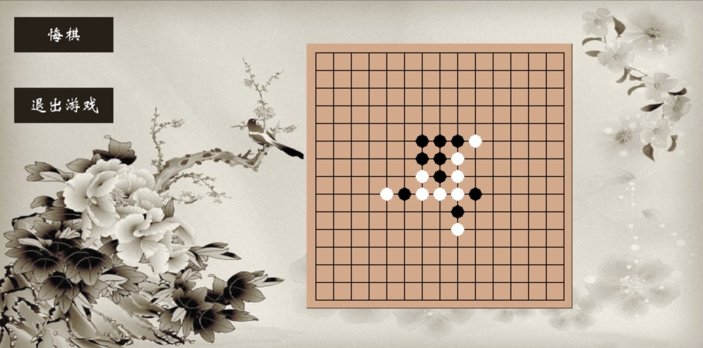

# Chess_AI——基于EasyX的AI五子棋
本实验以五子棋人机博弈问题为例，利用C++语言实现α-β剪枝算法的求解程序，并以棋型个数和权重为基础设计了适合五子棋博弈的评估函数。利用EasyX图形库显示15*15的空白棋盘，电脑执白棋，人执黑棋，黑棋先手，界面置有重新开始、悔棋等操作。合理设计五子棋程序的数据结构，实现的AI具有评估棋势、选择落子、判断胜负等功能。AI对战人类具有一定前瞻性和智能性，胜率较高。

